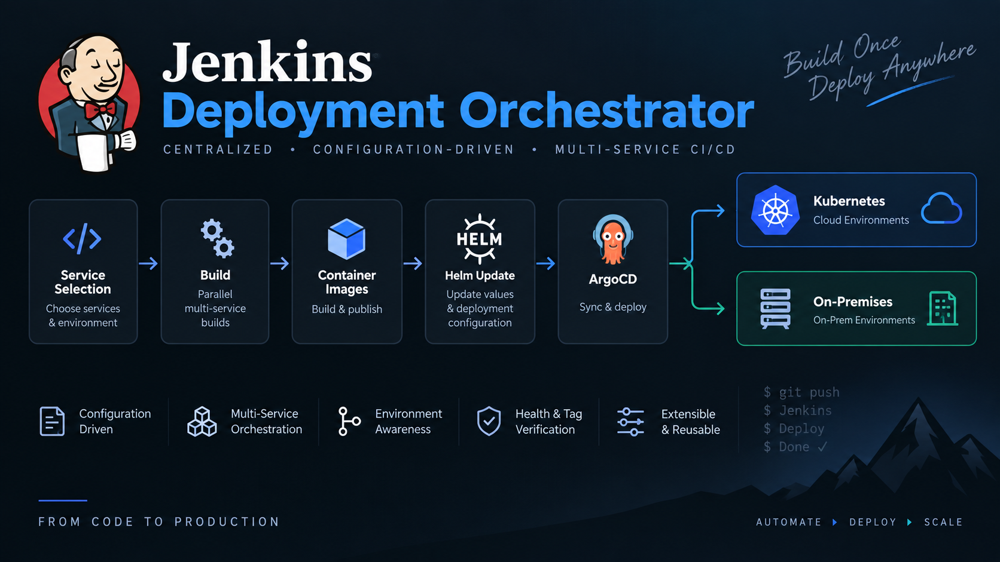

# Jenkins Deployment Orchestrator

A configuration-driven Jenkins Shared Library for coordinating deployments across multiple services and environments.

It provides one pipeline entry point to build selected services, publish images, promote images, update Helm values, synchronize Argo CD applications, run health and image-tag checks, and optionally apply application-configuration patches.

<p align="center">
  
</p>

<p align="center"><em>From service selection to Kubernetes or on-premise deployment.</em></p>

> This is a public, sanitized reference implementation. Every hostname, repository URL, job name, credential ID, application name and SSH target under `resources/deployment/` is an intentionally non-routable example.

## Features

- Select one or more backend services and, optionally, a frontend service.
- Trigger remote Jenkins build, image-push and promotion jobs.
- Deploy to on-premise targets or Kubernetes through Helm and Argo CD.
- Support dry runs, forced deployment of successful builds, health checks and tag verification.
- Update application properties in a configuration repository.
- Generate an HTML deployment summary through Jenkins Email Extension.
- Define services and all infrastructure-specific values through YAML—no product-specific service names are hard-coded in the pipeline.

## Repository layout

```text
Jenkinsfile                       # Minimal consumer pipeline
vars/masterDeploy.groovy          # Shared-library pipeline entry point
src/com/company/deploy/           # Pipeline services and integrations
resources/deployment/
  services.yml                    # Service catalogue and service types
  environments.yml                # Target environment definitions
  build-jobs.yml                  # Build jobs by build type
  deploy-jobs.yml                 # On-premise deployment jobs
  push-jobs.yml                   # Image-push jobs
  promotion-jobs.yml              # Image-promotion jobs
  helm.yml                        # Helm repositories, branches and charts
  argocd.yml                      # Argo CD servers and applications
  configuration.yml               # Application configuration deployment
```

## Prerequisites

- Jenkins with Pipeline and Shared Library support.
- Jenkins credentials configured for every `credentialId` referenced in YAML.
- The Jenkins Email Extension plugin if deployment emails are desired.
- The Active Choices plugin for the enhanced service/environment selectors. The pipeline falls back to standard Jenkins parameters when it is unavailable.
- For Kubernetes deployments: Git access to Helm charts, the `argocd` CLI, and network access to the relevant Argo CD server.
- For on-premise configuration deployment: `git`, `ssh` and `scp` on the Jenkins agent.

## Getting started

1. Configure this repository as a Jenkins Global Pipeline Library, for example with the name `jenkins-deployment-orchestrator`.
2. In a consumer repository, add the following `Jenkinsfile`:

   ```groovy
   @Library('jenkins-deployment-orchestrator') _

   masterDeploy()
   ```

3. Replace the example YAML values in `resources/deployment/` with values for your installation.
4. Create the referenced credentials in Jenkins. Credential IDs are identifiers only; credentials themselves must stay in Jenkins.
5. Set an environment's `implemented` property to `true` only when all referenced configuration is complete.

## Configuration

### Service catalogue

`resources/deployment/services.yml` is the source of truth for services displayed by the pipeline:

```yaml
services:
  SERVICE_API:
    displayName: API service
    imageName: example-api
    type: backend
    configurationTarget: api
  SERVICE_WEB:
    displayName: Web application
    imageName: example-web
    type: frontend
```

- `type: backend` services can be selected together.
- `type: frontend` services are offered as a single-choice selection.
- `imageName` is used for image-related operations.
- `deploymentKey` is optional; use it when multiple selectable services share a Helm or Argo CD definition.
- `configurationTarget` is optional; it enables that backend service as a target in `CONFIG_PATCH`.

### Environments and integrations

The remaining files map environment types to the tools your delivery process uses:

| File | Purpose |
| --- | --- |
| `environments.yml` | Environment DNS, type, build type, and enabled deployment capabilities. |
| `build-jobs.yml` | Remote Jenkins build jobs and parameter conventions. |
| `deploy-jobs.yml` | On-premise deployment jobs per environment. |
| `push-jobs.yml` / `promotion-jobs.yml` | Remote image publishing and promotion jobs. |
| `helm.yml` | Helm Git repositories, branches, chart paths and values files. |
| `argocd.yml` | Argo CD servers, credential references and application names. |
| `configuration.yml` | Configuration repository, target hosts and property-file mapping. |

## Security and publishing guidance

Do not commit any of the following to a public repository:

- Access tokens, passwords, private keys or kubeconfig files.
- Real credential IDs when their names disclose systems, customers or environments.
- Private DNS names, IP addresses, repository URLs, application names, job names or SSH users.
- Deployment reports, Jenkins console logs, exported credentials or local IDE metadata.

Use non-routable placeholders such as `example.invalid` in public examples. Keep your real deployment configuration in a private repository, a private library branch, or another access-controlled configuration source. The included `.gitignore` excludes `resources/deployment/*.local.yml` for local, organization-specific variants.

Before publishing, run a final scan tailored to your organization:

```bash
rg -n -i 'your-company|internal-domain|customer-name|real-credential-id' .
git status
git diff --cached
```

## License

No license is currently included. Add a license file before accepting external contributions or reuse.
